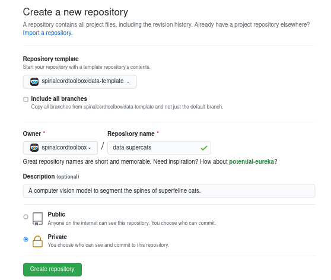

# `data-${dataset_name}`

Part of [`spinalcordtoolbox`](https://github.com/spinalcordtoolbox).


## Using the Template

1. Make a [new repo](https://github.com/new) using this as its template.

    Name it `spinalcordtoolbox/data-${dataset_name}` where `${dataset_name}` is something usefully descriptive:

    

2. Download the new repo
    
    ```bash
    git clone git@github.com:spinalcordtoolbox/data-${dataset_name}
    cd data-${dataset_name}
    ```
    
3. Fill with initial metadata
    
    ```bash
    # 1. Find and replace ${dataset-name} with the name you picked (e.g. `supercats`)
    perl -pi -e 's/\${dataset_name}/supercats/' README.md
    perl -pi -e 's/\${dataset_name}/supercats/' setup.py
   
    # 2. Rename the repo's `dataset` folder to match the repo name
    git mv src/spinalcordtoolbox/data/dataset src/spinalcordtoolbox/data/${dataset_name}
   
    # 3. Commit the changes 
    git add -u
    git commit -m "Setting data-${dataset_name} package metadata"
    git push
    ```
    
4. Fill with initial data and upload
    
    ```bash
    # 1. Copy over the data files to the dataset folder in this repo
    cp ${data_files} src/spinalcordtoolbox/data/${dataset_name}
   
    # 2. Add, commit, and push the newly-added files
    git add .
    git commit -m "Copy over data files to dataset folder"
    git push
    ```

5. Remove the "Using this template" section from `README.md`, since it is now no longer needed.

    ```bash
    # Delete the 'Using the Template' section from `README.md
    vi README.md
   
    # Add, commit, and push the changes
    git add README.md
    git commit -m "Removing template section from README.md"
    git push
    ```


## How to update this dataset

1. Edit and commit the files in `src/spinalcordtoolbox/data/`
2. Go to https://github.com/spinalcordtoolbox/data-${dataset_name}/releases

    1. Click "Draft Release"
    2. Fill in a version tag. We use date-based release names (e.g. `r20200101, `r20220518`, etc.)
    3. Click "Publish Release"
    4. Wait a few minutes;
    5. Monitor the progress at https://github.com/spinalcordtoolbox/data-${dataset_name}/actions/workflows/release.yml
    6. The release should appear on https://github.com/spinalcordtoolbox/data-${dataset_name}/releases
       with the .tar.gz (sdist) and .whl (wheel) formats attached momentarily.

## Troubleshooting

You can test the repo locally with

```
pip install build &&
  python -m build --wheel --sdist &&
  pip install dist/*.whl
```

This should give you enough clues hopefully to track down any problems.
